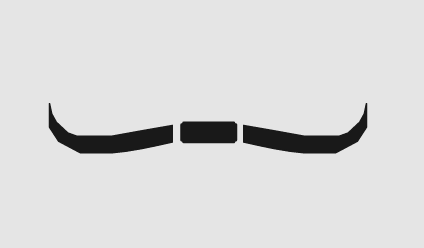

[![Contributors][contributors-shield]][contributors-url]
[![Forks][forks-shield]][forks-url]
[![Stargazers][stars-shield]][stars-url]
[![Issues][issues-shield]][issues-url]
[![MIT License][license-shield]][license-url]
[![LinkedIn][linkedin-shield]][linkedin-url]


<!-- PROJECT LOGO -->
<br />
<p align="center">
  <a href="https://caiodev1.github.io/newlayout/#/">
    
  </a>

  <h3 align="center">Mindzone New Layout Prototype</h3>

  <p align="center">
    Protótipo do novo layout/UI da aplicação Mindzone
    <br />
    <a href="https://caiodev1.github.io/newlayout/#/"><strong>Abrir app »</strong></a>
    <br />
    <br />
    <a href="https://github.com/CaioDev1/newlayout/issues">Reportar Bug</a>
    .
    <a href="https://github.com/CaioDev1/newlayout/issues">Requisitar funcionalidades</a>
  </p>
</p>


<!-- TABLE OF CONTENTS -->
<details open="open">
  <summary>Sumário</summary>
  <ol>
    <li>
      <a href="#sobre-o-projeto">Sobre o projeto</a>
      <ul>
        <li><a href="#feito-utilizando">Feito utilizando</a></li>
      </ul>
    </li>
    <li>
      <a href="#iniciando">Iniciando</a>
      <ul>
        <li><a href="#instalação">Instalação</a></li>
      </ul>
    </li>
    <li><a href="#mais-informações">Mais informações</a></li>
    <li><a href="#licença">Licença</a></li>
    <li><a href="#contato">Contato</a></li>
  </ol>
</details>


<!-- ABOUT THE PROJECT -->
<h2 id="sobre-o-projeto">💡 Sobre o projeto</h2>

[![Product Name Screen Shot][product-screenshot]](https://caiodev1.github.io/newlayout/#/)

Esse projeto é um protótipo de interface da aplicação Mindzone, uma rede social para nicho criativo, nesse novo layout a intenção é criar um ambiente mais minimalista e mais "clean" com relação ao design,
assimilando mais a experiência de uso de outras redes sociais do mercado, com uma navegação mais simples e natural.

[![Product Name Screen Shot2][product-screenshot2]](https://caiodev1.github.io/newlayout/#/)

* Acesse a conteúdo de notificações e mensagem na tela inicial;
* Visualize os amigos que estão online;
* Aproveite de uma interface mais limpa e agradável;
* Comentários acessíveis ainda no feed;
* Visualize os amigos e postagens de um usuário com 1 clique;
* Edite os dados do seu perfil;

<h3 id="feito-utilizando">🔧 Feito Utilizando</h3>

Para uma maior fluídez da aplicação na parte do frontend, foi utilizado ReactJS junto com a biblioteca Styled Components para estilização e Material UI para animações.

Segue a lista de ferramentas:
* [ReactJS](https://pt-br.reactjs.org/)
* [Styled Components](https://styled-components.com/)
* [Material UI](https://material-ui.com/pt/)

<!-- GETTING STARTED -->
<h2 id="Iniciando">📖 Iniciando</h2>

Para inicialização correta da aplicação, primeiro é necessário que o NodeJS e o gerenciador de pacotes NPM esteja instalado e atualizado.

Para isso, siga os seguintes passos:

<h3 id="instalação">⚙ Instalação</h3>

1. Clone o repositório
   ```sh
   git clone https://github.com/CaioDev1/newlayout.git
   ```
2. Instale os pacotes e dependências via NPM
   ```sh
   npm install
   ```


<!-- USAGE EXAMPLES -->
<h2 id="mais-informações">ℹ Mais Informações</h2>
Para acessar o repositório com o layout original:

_[Mindzone](https://github.com/CaioDev1/socialmedia-frontend)_

<!-- ROUTES -->
<h2 id="rotas">🛣 Rotas</h2>
<table>
  <thead>
    <tr>
      <th>ROTA</th>
    </tr>
  </thead>
  <tbody>
    <tr>
      <td>/register</td>
    </tr>
    <tr>
      <td>/login</td>
    </tr>
    <tr>
      <td>/</td>
    </tr>
    <tr>
      <td>/profile</td>
    </tr>
    <tr>
      <td>/profile-photo</td>
    </tr>
  </tbody>
</table>

<!-- LICENSE -->
<h2 id="licença">📜 Licença</h2>

Distribuído sobre a licença MIT. Veja `LICENSE` para mais informações.


<!-- CONTACT -->
<h2 id="contato">📩 Contato</h2>

Caio Cardoso - [@itsme_caio](https://instagram.com/itsme_caio) - imcaiofelipe@outlook.com

Link do projeto: [https://github.com/CaioDev1/newlayout](https://github.com/CaioDev1/newlayout)


<!-- MARKDOWN LINKS & IMAGES -->
<!-- https://www.markdownguide.org/basic-syntax/#reference-style-links -->
[contributors-shield]: https://img.shields.io/github/contributors/CaioDev1/newlayout.svg?style=for-the-badge
[contributors-url]: https://github.com/CaioDev1/newlayout/graphs/contributors
[forks-shield]: https://img.shields.io/github/forks/CaioDev1/newlayout.svg?style=for-the-badge
[forks-url]: https://github.com/CaioDev1/newlayout/network/members
[stars-shield]: https://img.shields.io/github/stars/CaioDev1/newlayout.svg?style=for-the-badge
[stars-url]: https://github.com/CaioDev1/newlayout/stargazers
[issues-shield]: https://img.shields.io/github/issues/CaioDev1/newlayout.svg?style=for-the-badge
[issues-url]: https://github.com/CaioDev1/newlayout/issues
[license-shield]: https://img.shields.io/github/license/CaioDev1/newlayout.svg?style=for-the-badge
[license-url]: https://github.com/CaioDev1/newlayout/blob/master/LICENSE.txt
[linkedin-shield]: https://img.shields.io/badge/-LinkedIn-black.svg?style=for-the-badge&logo=linkedin&colorB=555
[linkedin-url]: https://www.linkedin.com/in/caio-cardoso-158133196
[product-screenshot]: public/newlayout-gif1.gif
[product-screenshot2]: public/newlayout-gif2.gif
